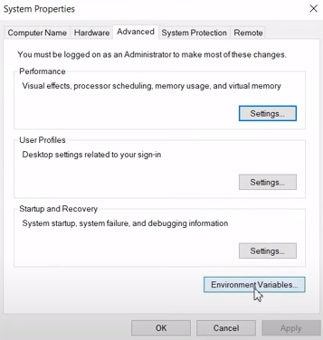

# Project Overview
This repository contains a simple Flask application that serves as a customer feedback form. The submitted data is sent to a Kafka topic. The Kafka consumer, implemented as a Spark application, processes the data and writes it to a Cassandra table.

The ultimate goal of the project is to serve as a simple example on how to use Pyspark to create a consumer and how to read data from Casssandra.


The Flask application contains 3 fields: service rating, product rating. The service rating and product rating fields are drop down choice sections while the comments field is a free text field. The app functions as follows:

1. The user selects a value for the ratings and writes a comment (optional).
2. After clicking submit the Flask app generates a timestamp when the review was posted, inserts the values from the form to a dictionary. Then the value dictionary and the timestamp is sent to the spark_app which functions as the Kafka consumer.
3. The consumer inserts the data to a Cassandra table.
4. Optional: There is also a spark app for reading the data from Cassandra but it should be noted that Spark doesnt support streamed reading from Cassandra. This is why the reading was done using a while loop which reads the data once every 10 seconds and displays the averages. More better way of doing this could be for example using Apache Airflow to read the data from the table and do the necessary next steps, for example add any new rows to a relational database.

# Setup 

0. Note JDK is required for this project so it needs to be downloaded first.
1. Setup Kafka and create a topic for the project. Check this repositorys readme for info: https://github.com/SirNicholas1st/kafka_datastream
2. Setup Cassandra and create a keyspace for the project. The repository above also includes a how to do this.
3. Install Spark. Details below:

## Installing Apache Spark

1. Download Apache Spark from here https://spark.apache.org/downloads.html. Package type: *Pre-built for Apache Hadoop 2.7*
2. Create a new folder to for example to your C-drive and extract the file there.
3. Download winutils exe file from here: https://github.com/steveloughran/winutils. Select the correct hadoop version and open the bin directory and download **winutils.exe** file
4. Create a new folder called "hadoop" and a folder called "bin" under the created hadoop folder and paste the downloaded file to the bin directory.
5. Use windows search to find "Edit the system environment variables"
6. Select Environment variables



7. Create the following variables: JAVA_HOME path: jdk folder, HADOOP_HOME path: the hadoop folder you created, SPARK_HOME path: the extracted folder under the created spark folder, PYSPARK_HOME path: your python folder + python.exe for example D:\Python\python.exe.
8. Under system variables select "Path"


9. Click edit and add the following paths: %HADOOP_HOME%/bin, %SPARK_HOME%/bin
10. Verify the installation by opening a cmd and starting a spark shell with the command "spark-shell". The output should be the following:


NOTE: The start up might take a while and if the the command doesnt work, run the cmd as and admin.

# Folder Structure
```
|   .gitignore
|   README.md
|
+---Code
|   |   flask_app.py
|   |   spark_app.py
|   |   spark_read_data.py
|   |
|   +---static
|   |   \---css
|   |           main.css
|   |           thank_you.css
|   |
|   \---templates
|           form.html
|           submitted.html
|
\---Pics
        dataflow.png
        environment_vars_1.png
        form.png
        path.png
        spark_shell.png
        thank_you.png
```

# Screenshots 

1. The Flask app form


2. The thank you page


